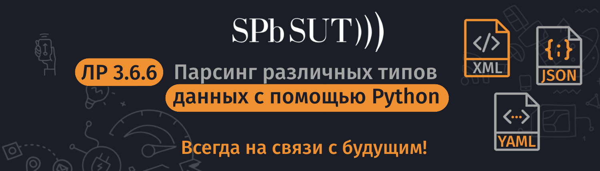

# Парсинг различных типов данных с помощью Python

## Цель лабораторной работы:
- Часть 1: Запуск виртуальной машины DEVASC
- Часть 2: Разбор XML в Python
- Часть 3: Разбор JSON в Python
- Часть 4: Разбор YAML в Python

## Необходимые ресурсы:
- 1 ПК
- Virtual Box или VMWare
- DEVASC виртуальная машина

##Порядок выполнения работы
## Часть 1: Запуск виртуальной машины DEVASC
> Если вы еще не завершили лабораторную работу - Установка лабораторной среды виртуальной машины, сделайте это сейчас. Если вы уже завершили эту лабораторную работу, запустите виртуальную машину DEVASC.
## Часть 2: Разбор XML в Python
> Из-за гибкости, которую обеспечивает расширяемый язык разметки (XML), он может быть сложным для анализа. Поля данных XML с текстовыми метками не однозначно отображаются на типы данных по умолчанию в Python или других популярных языках. Кроме того, не всегда очевидно, как значения атрибутов должны быть представлены в данных.
```xml
<?xml version="1.0" encoding="UTF-8"?>
<rpc message-id="1" xmlns="urn:ietf:params:xml:ns:netconf:base:1.0">
  <edit-config>
    <target>
      <candidate/>
    </target>
    <default-operation>merge</default-operation>
    <test-option>set</test-option>
    <config>
      <int8.1 xmlns:nc="urn:ietf:params:xml:ns:netconf:base:1.0" nc:operation="create" xmlns="http://netconfcentral.org/ns/test">9</int8.1>
    </config>
  </edit-config>
</rpc>
```

## Шаг 1: Создайте сценарий для разбора данных XML.
Откройте файл parsexml.py, находящийся в каталоге ~/labs/devnet-src/parsing.
Импортируйте модуль ElementTree библиотеки xml и механизм регулярных выражений. Модуль ElementTree будет использоваться для выполнения синтаксического анализа. Механизм регулярных выражений будет использоваться для поиска определенных данных.

> Примечание: Если у вас нет опыта использования регулярных выражений в Linux, Python или других объектно-ориентированных языках программирования, поищите учебники в интернете.
```python
import xml.etree.ElementTree as ET
import re
```
Затем с помощью функции parse из ET (ElementTree) разберите файл myfile.xml и присвойте его переменной (xml). Затем получите корневой элемент с помощью функции getroot и присвойте его переменной (root).
```python
xml = ET.parse("myfile.xml")
root = xml.getroot()
```
Теперь на верхнем уровне дерева можно искать содержащий тег <edit-config>, а когда он найден, этот блок тегов можно искать по двум именованным значениям, которые он содержит: <default-operation> и <test-option>. Создайте регулярное выражение для получения содержимого корня XML в теге <rpc>, а затем добавьте дополнительные регулярные выражения для углубления в содержимое, чтобы найти значение элементов <edit-config>, <default-operation> и <test-option>.
```python
ns = re.match('{.*}', root.tag).group(0)
editconf = root.find("{}edit-config".format(ns))
defop = editconf.find("{}default-operation".format(ns))
testop = editconf.find("{}test-option".format(ns))
```
Добавьте `print()` для вывода значения элементов <default-operation> и <test-option>
```python
print("Операция по умолчанию содержит: {}".format(defop.text))
print("Тестовая опция содержит: {}".format(testop.text))
```

### Шаг 2: Запустите скрипт.
Сохраните и запустите файл `parsexml.py`. Вы должны получить следующий результат.
```shell
devasc@labvm:~/labs/devnet-src/parsing$ python3 parsexml.py 
Операция по умолчанию содержит: merge
Тестовая опция содержит: set
devasc@labvm:~/labs/devnet-src/parsing$
```

## Часть 3: Разбор JSON в Python
> Разбор JavaScript Object Notation (JSON) является частым требованием при взаимодействии с REST API. Алгоритм разбора выполняется следующим образом:
> 1)	Пройдите аутентификацию, используя комбинацию пользователь/пароль, чтобы получить токен, срок действия которого истекает через определенное время. Этот маркер используется для аутентификации последующих запросов.
> 2)	Выполните GET-запрос к REST API, аутентифицировавшись при необходимости, чтобы получить состояние ресурса, запросив JSON в качестве выходного формата.
> 3)	Измените полученный JSON, если это необходимо.
> 4)	Выполните POST (или PUT) к тому же REST API (опять же, аутентификация по необходимости), чтобы изменить состояние ресурса, снова запрашивая JSON в качестве выходного формата и интерпретируя его по мере необходимости, чтобы определить, была ли операция успешной.
> 
> Пример JSON для разбора — это ответ на запрос токена:
> ```json
> {
>   "access_token" : "ZDI3MGEyYzQtNmFlNS00NDNhLWFlNzAtZGVjNjE0MGU1OGZmZWNmZDEwN2ItYTU3",
>   "expires_in" : 1209600,
>   "refresh_token" : "MDEyMzQ1Njc4OTAxMjM0NTY3ODkwMTIzNDU2Nzg5MDEyMzQ1Njc4OTEyMzQ1Njc4",
>   "refreshtokenexpires_in" : 7776000
> }
> ```
> В Python скриптах библиотека json может быть использована, как нистранно, для разбора JSON в структуры данных Python и сериализации структур данных обратно в JSON. Библиотека yaml может быть использована для преобразования данных в YAML.
> 
> Следующая программа использует оба модуля для разбора приведенных выше данных JSON, извлечения и печати значений данных, а также вывода YAML-версии файла. Она использует метод json библиотеки loads() для разбора строки, в которую был считан файл. Затем он использует обычные ссылки на данные Python для извлечения значений из полученной структуры данных Python. Наконец, он использует функцию yaml библиотеки dump() для сериализации данных Python обратно в виде YAML на терминал.

### Шаг 1: Создайте сценарий для разбора данных JSON.
Откройте файл parsejson.py, находящийся в каталоге ~/labs/devnet-src/parsing.
Импортируйте библиотеки json и yaml.
```python
import json
import yaml
``` 
С помощью оператора Python with откройте файл myfile.json и установите его в переменную с именем json_file. Затем используйте метод json.load для загрузки файла JSON в строку, заданную переменной ourjson.
> Примечание: Нет необходимости явно закрывать файл, так как оператор with обеспечивает правильное открытие и закрытие файла.
```python
with open('myfile.json','r') as json_file:
    ourjson = json.load(json_file)
``` 

Добавьте оператор print для ourjson, чтобы увидеть, что теперь это словарь Python.
```python
print(ourjson)
```

### Шаг 2: Запустите сценарий для печати данных JSON, а затем измените его для печати интересующих вас данных.
Сохраните и запустите свой сценарий. Вы должны увидеть следующий результат.
```shell
devasc@labvm:~/labs/devnet-src/parsing$ python3 parsejson.py 
{'access_token': 'ZDI3MGEyYzQtNmFlNS00NDNhLWFlNzAtZGVjNjE0MGU1OGZmZWNmZDEwN2ItYTU3', 'expires_in': 1209600, 'refresh_token': 'MDEyMzQ1Njc4OTAxMjM0NTY3ODkwMTIzNDU2Nzg5MDEyMzQ1Njc4OTEyMzQ1Njc4', 'refreshtokenexpires_in': 7776000}
devasc@labvm:~/labs/devnet-src/parsing$
```

### Шаг 3: Вывод разобранных данных JSON в формате данных YAML.
Добавьте оператор print, который выведет три тире, необходимые для файла YAML. Два \n добавят две строки после предыдущего вывода. Затем добавьте оператор для печати ourjson в виде данных YAML с помощью метода dump() библиотеки yaml.
```python
print("\n\n---")
print(yaml.dump(ourjson))
```
Сохраните и запустите свой скрипт. Вы должны увидеть следующий результат.
```shell
devasc@labvm:~/labs/devnet-src/parsing$ python3 parsejson.py 
<результаты предыдущих шагов опущены>
---
access_token: ZDI3MGEyYzQtNmFlNS00NDNhLWFlNzAtZGVjNjE0MGU1OGZmZWNmZDEwN2ItYTU3
expires_in: 1209600
refresh_token: MDEyMzQ1Njc4OTAxMjM0NTY3ODkwMTIzNDU2Nzg5MDEyMzQ1Njc4OTEyMzQ1Njc4
refreshtokenexpires_in: 7776000

devasc@labvm:~/labs/devnet-src/parsing$
```
> Примечание: Для компактности скриншота, автор закомментировал строчку `print(ourjson)`

## Часть 4: Разбор YAML в Python
> Следующая программа импортирует библиотеки json и yaml, использует PyYAML для разбора файла YAML, извлечения и печати значений данных и вывода JSON-версии файла. Он использует метод библиотеки yaml safe_load() для разбора потока файлов и обычные ссылки на данные Python для извлечения значений из полученной структуры данных Python. Затем он использует функцию json библиотеки dumps() для сериализации данных Python обратно в виде JSON.
> Пример YAML для разбора — это тот же файл YAML, который вы вывели в Части 3:
> ```yaml
> ---
> access_token: ZDI3MGEyYzQtNmFlNS00NDNhLWFlNzAtZGVjNjE0MGU1OGZmZWNmZDEwN2ItYTU3
> expires_in: 1209600
> refresh_token: MDEyMzQ1Njc4OTAxMjM0NTY3ODkwMTIzNDU2Nzg5MDEyMzQ1Njc4OTEyMzQ1Njc4
> refreshtokenexpires_in: 7776000
> ```

### Шаг 1: Создайте скрипт для разбора данных YAML.
Откройте файл `parseyaml.py`, находящийся в каталоге ~/labs/devnet-src/parsing.

Импортируйте библиотеки json и yaml.
```python
import json
import yaml
```
Используйте оператор with, чтобы открыть myfile.yaml и установить его в переменную с именем yaml_file. Затем используйте метод yaml.safe_load для загрузки файла YAML в строку, заданную переменной ouryaml.
```python
with open('myfile.yaml','r') as yaml_file:
    ouryaml = yaml.safe_load(yaml_file)
```
Добавьте print() для ouryaml, чтобы увидеть, что теперь это словарь Python.
```python
print(ouryaml)
```

### Шаг 2: Запустите сценарий для печати данных YAML, а затем измените его для печати интересующих вас данных.

Сохраните и запустите свой сценарий. Вы должны увидеть следующий результат.
```shell
devasc@labvm:~/labs/devnet-src/parsing$ python3 parseyaml.py 
{'access_token': 'ZDI3MGEyYzQtNmFlNS00NDNhLWFlNzAtZGVjNjE0MGU1OGZmZWNmZDEwN2ItYTU3', 'expires_in': 1209600, 'refresh_token': 'MDEyMzQ1Njc4OTAxMjM0NTY3ODkwMTIzNDU2Nzg5MDEyMzQ1Njc4OTEyMzQ1Njc4', 'refreshtokenexpires_in': 7776000}
devasc@labvm:~/labs/devnet-src/parsing$
```
Добавьте операторы печати, которые отображают значение токенов и количество секунд до истечения его срока действия.
```python
print("Токен доступа {}".format(ouryaml['access_token']))
print("Он истечёт через {} секунд.".format(ouryaml['expires_in']))
```
Сохраните и запустите свой сценарий. Вы должны увидеть следующий результат.

### Шаг 3: Выведите разобранные данные YAML в формате JSON.
Добавьте print(), чтобы добавить две пустые строки после предыдущего вывода. Затем добавьте оператор для печати ouryaml в виде данных JSON с помощью метода dumps() библиотеки json. Добавьте параметр отступа, чтобы приукрасить данные JSON.
```python
print("\n\n")
print(json.dumps(ouryaml, indent=4))
```
Сохраните и запустите свой скрипт. Вы должны увидеть следующий вывод. Обратите внимание, что вывод выглядит так же, как myfile.json.
```shell
devasc@labvm:~/labs/devnet-src/parsing$ python3 parseyaml.py 
<результаты предыдущих шагов опущены>
{
  "access_token": "ZDI3MGEyYzQtNmFlNS00NDNhLWFlNzAtZGVjNjE0MGU1OGZmZWNmZDEwN2ItYTU3",
  "expires_in": 1209600,
  "refresh_token": "MDEyMzQ1Njc4OTAxMjM0NTY3ODkwMTIzNDU2Nzg5MDEyMzQ1Njc4OTEyMzQ1Njc4",
  "refreshtokenexpires_in": 7776000
}
devasc@labvm:~/labs/devnet-src/parsing$
```